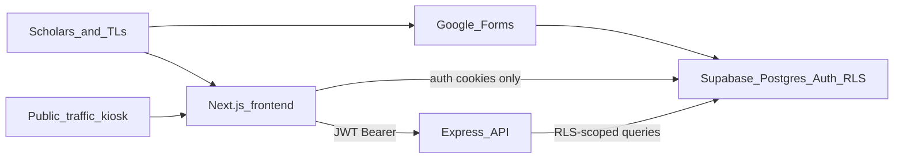

# CSS Atlas — current-state briefing and IT vetting proposal

**Docs:** `docs/dev/it-review.md`

## Navigation

[← Root](README.md) › IT review

Related: [Deployment](deployment/README.md) · [Supabase](supabase/README.md) · [Auth & RLS runbook](onboarding/auth-rls-runbook.md) · [Roles & personas](onboarding/roles-and-personas.md) · [Public schema](supabase/public-schema.md)

---

## Purpose

CSS Atlas is the College Success Scholars program’s scholar-management web app. It shows weekly attendance, form compliance (WAHF / WPL / MCF), mentorship activity, and Memo reporting for program staff and scholars at the University of Maryland.

This page is a **shareable briefing** for program leadership and UMD Division of IT (DIT). The next section is the ask to the office director. Everything after that is the packet for DIT and technical contacts. It is not a developer architecture dump — request flow, auth, and RLS details live in the linked handbook pages.

---

## Request to the office director

**We ask the director of this office to approve taking CSS Atlas through UMD Division of IT’s Software Risk Management (SRM) review.**

You do not need to read the technical sections below. Those exist so DIT can evaluate the system. This section is the decision.

### What we are asking you to approve

CSS Atlas is the program’s web tool for weekly scholar attendance, required forms, mentorship notes, and the Weekly Memo. It already holds **student academic and program records** (names, university IDs, emails, grades from weekly forms, attendance, mentoring notes). Some of that data already lives with outside campus vendors (for example Google Forms, and the cloud database and hosting we use to run the app).

Campus policy requires DIT to review software and cloud tools that store this kind of information. Student developers **cannot** start that review or sign vendor agreements. A faculty or staff member must. That is why we need your approval — and, unless you designate someone else on staff, your name on the campus request.

### What “yes” means — and what it does not

| You are being asked to | You are not being asked to |
|------------------------|----------------------------|
| Allow us to submit CSS Atlas (and the vendors it uses) to DIT for official review | Learn the technical architecture or read the rest of this page |
| Serve as the office’s **requestor** in Workday, or name a staff member who will | Sign a vendor contract yourself — only UMD Procurement can do that |
| Let the student development team remain the **technical contacts** DIT can email with follow-up questions | Approve a large new purchase up front. Some tools are already in use or low-cost; Procurement handles any agreement after DIT review |
| Accept that review typically takes **about 3–4 weeks** after DIT has a complete packet | Decide FERPA, security, or accessibility outcomes — DIT makes those calls |

A “yes” is permission to **start the campus review**, not a claim that the app is already fully approved for production.

### Decision we need

Please reply with one of:

1. **Approved** — proceed with DIT SRM; I will be the requestor (or I designate: _name_).
2. **Approved, with conditions** — proceed, but first _…_.
3. **Hold** — do not contact DIT yet; reason: _…_.

Technical contacts after you approve: [Miguel](mailto:miguelventura1123@gmail.com), [Ben](mailto:bsaenz454@gmail.com), [Moosay](mailto:97802676+m0osay@users.noreply.github.com). DIT intake: [software-risk-mgmt@umd.edu](mailto:software-risk-mgmt@umd.edu) · [it.umd.edu/SRM](https://it.umd.edu/SRM).

---

## Current product state

### In use (backed by live Supabase data)

| Surface | Who | What it does |
|---------|-----|----------------|
| Auth (`/auth/*`) | Any UMD email | Sign up (`@umd.edu` / `@terpmail.umd.edu`), login, email confirm, complete profile |
| Role-based dashboards (`/dashboard`) | Scholar, team leader, developer | Home view chosen from `app_role` / `program_role` |
| Personal activity (`/dashboard/personal`) | Authenticated | Own weekly activity and stats |
| Mentee monitoring (`/dashboard/mentee`) | Team leader+ | Assigned mentees |
| Scholar directory (`/dashboard/directory`) | Authenticated | Program directory |
| Weekly Memo (`/dashboard/memo`) | Team leader+ | Attendance minutes (computed on read), excuses, form compliance, scholar follow-up |
| Form / log consumption | Team leader+ APIs | Reads Google Forms → Postgres rows; does not collect those forms in-app |
| Foot-traffic kiosk (`/traffic`) | Public (no login) | Records uid + duration; analytics stay private |
| Developer scratchpad (`/dev/*`) | Developer only | Raw logs, profiles, traffic analytics |

Operational form and session-log rows (WAHF, WPL, MCF, tutoring, front desk, study sessions) are **populated by an existing Google Forms → Supabase intake**, not by in-app forms. The Express API mostly **reads** those tables and derives aggregates. Atlas is not a replacement for that intake. Details: [Form / log intake](supabase/README.md#form--log-intake-google-forms).

### Not production-ready / not the review focus

| Surface | Status |
|---------|--------|
| `/dashboard/events` | Hardcoded mock events — not live program data |
| `/dashboard/internship-board` | UI exists; not the operational core of this review |
| `/dashboard/memo-legacy` | Kept for reference |
| `/dev/*` | Scratchpad — not production UI |
| `/dashboard/teams/front-desk`, `/dashboard/teams/study` | Temporary team pages |

### Data flow

Domain data goes **frontend → backend → Supabase**. The frontend does not run domain queries against Supabase. Auth signup/login/session stay on the frontend Supabase client; the backend only **verifies** the JWT and applies row-level security. Full topology: [Deployment](deployment/README.md).

---

## Tech stack

| Layer | Choice | Why it matters to IT |
|-------|--------|----------------------|
| Frontend | Next.js 16, React 19, Tailwind 4, Radix / shadcn-ui | Browser app; `@vercel/analytics` is present |
| Backend | Node.js 22, Express 5, TypeScript | REST under `/api/*`; no Supabase Edge Functions |
| Shared | `@css-atlas/shared` TypeScript library | Campus calendar / week math only — no database access |
| Auth + database | Supabase (PostgreSQL, JWT, RLS) | System of record for education records; **no service-role key in application code** |
| Hosting | Railway (split frontend/backend) and/or Vercel same-origin (`/_/backend`); Docker Compose for CI | Off-campus cloud. Confirm the live production shape before submitting SRM |
| CI | GitHub Actions: test, lint, build, compose smoke | No authenticated E2E against a live Supabase project in CI |
| Intake | Google Forms → Postgres | Already a third-party pipeline outside the app |

**Secrets in app env:** Supabase URL + publishable/anon key, `CORS_ORIGIN`, `BACKEND_URL` / `NEXT_PUBLIC_BACKEND_URL`. Canonical lists: [Environment variables](README.md#environment-variables). The Supabase **service-role** key is ops-only (interactive scripts), never loaded from project `.env` files, and not documented in `.env.example`.

---

## Data classification

This app stores **education records** (identity plus academic and program-activity data), not only directory information. Under UMD’s data classification standard (IT-2), that is likely **High (Level 3)**. DIT Data Privacy — not this briefing — makes the official call.

| Category | Examples in Atlas |
|----------|-------------------|
| Scholar identity | Name, UID (`student_id`), UMD email, phone, cohort, majors |
| Academic performance | WAHF `assignment_grades`, grade trends |
| Attendance | Front-desk and study-session minutes, team-leader excuses |
| Mentoring | MCF support ratings and check-in notes |
| Staff work logs | WPL (team-leader hours and work completed) |

**Not in this app:** payment cards, Social Security numbers, or HIPAA-regulated health records.

High (Level 3) or Restricted (Level 4) data, or instructional use, **blocks Expedited Procurement**. Full [Software Risk Management (SRM)](https://it.umd.edu/SRM) is the correct path.

### Access model (for the assessment form)

- The frontend sends the user’s JWT to Express; the backend verifies it and runs table queries as that user so **RLS applies**. See [Auth & RLS runbook](onboarding/auth-rls-runbook.md).
- Roles (lowest → highest): scholar (`app_role` null) → `team_leader` → `developer`. Memo and most aggregates are team-leader+. See [Roles & personas](onboarding/roles-and-personas.md).
- `/traffic` is a public **write** of uid + duration only; traffic analytics stay auth-gated.

Table-level catalog (summarize for SRM; do not attach the full column dump unless asked): [Public schema](supabase/public-schema.md).

---

## Third parties to list on the SRM form

Each of these is a vendor or click-through SaaS that processes institutional data:

| Vendor | Role |
|--------|------|
| **Supabase** | Auth + Postgres (system of record) |
| **Google Forms / Google** | Form and log intake (already in use) |
| **Railway and/or Vercel** | App hosting — confirm which environment is production |
| **GitHub** | Source and CI (no production student database in CI) |
| **Vercel Analytics** | Frontend telemetry — confirm what it collects before listing |

CSS Atlas itself is custom code, not a purchased product. SRM still applies because institutional data moves to third-party cloud (including “free” or already-paid tools).

The requestor should check DIT’s [Software List](https://it.umd.edu/SRM) first. Google is often already approved for some campus uses; Supabase, Railway, and Vercel likely need a new or scoped review.

**Process constraint:** a UMD **faculty or staff** member must initiate SRM in Workday. Student developers cannot sign vendor agreements. Only Procurement and Business Services has signatory authority.

Technical contacts for the request: [Miguel](mailto:miguelventura1123@gmail.com), [Ben](mailto:bsaenz454@gmail.com), [Moosay](mailto:97802676+m0osay@users.noreply.github.com) — see [Ask / don’t touch](onboarding/ask-and-dont-touch.md).

---

## Controls already in place

Reviewers can audit these against the running system and the repo:

- JWT + RLS on every domain query. Documented rule: do not put a service-role key in application code ([Auth & RLS runbook](onboarding/auth-rls-runbook.md)).
- Role middleware on `/api/*`. The only unprotected route is `GET /` (health check).
- UMD email restriction on self-service profile create.
- Developer “act as” personas send a `dev_test_profiles.id`, not a raw roster UID; many writes are denylisted while acting.
- Schema / RLS / RPC changes ship as `supabase/migrations/` PRs. Dashboard SQL is emergency-only.
- CI: Vitest (frontend and backend), ESLint, production builds, Docker Compose smoke (`GET /` health, auth-gated `401`s, CORS).
- Public kiosk: Zod-validated insert, no client-supplied timestamps, INSERT-only RLS preferred ([traffic README](frontend/app/traffic/README.md)).

---

## Gaps DIT is likely to flag

State these up front; they are expected review topics, not surprises.

| Topic | Current state |
|-------|----------------|
| Campus SSO | Login is Supabase email/password plus email confirm — not CAS / Shibboleth |
| Accessibility | No VPAT or formal WCAG audit of the custom UI (Title II is in SRM’s remit) |
| Vendor artifacts | Need SOC 2 (or equivalent) from Supabase and Railway/Vercel; Google is typically already covered for some uses |
| Public kiosk | Anyone who knows a scholar UID can record a traffic entry; by design for shared devices, but a privacy/abuse item |
| Google Forms intake | Grades and submitter emails land in Postgres **outside** the app’s auth model |
| Hosting shape | Confirm live production (Railway split vs Vercel same-origin) before submitting |
| Dev routes | `/dev` must stay developer-only in production |

This briefing does not conclude FERPA applicability or residual risk. DIT IT Compliance, Data Privacy, and Accessibility make those determinations.

---

## Proposed vetting path

1. **Office director approval** — send the [Request to the office director](#request-to-the-office-director) (this page, or a short email that copies that section). Do not contact DIT until the director approves and names the faculty/staff requestor.
2. **Confirm requestor and technical contacts** — the director (or their staff designee) is the Workday requestor. Developers remain technical contacts: [Miguel](mailto:miguelventura1123@gmail.com), [Ben](mailto:bsaenz454@gmail.com), [Moosay](mailto:97802676+m0osay@users.noreply.github.com).
3. **Email [software-risk-mgmt@umd.edu](mailto:software-risk-mgmt@umd.edu)** (or Thursday SRM office hours listed on [it.umd.edu/SRM](https://it.umd.edu/SRM)) with this briefing. Ask: (a) whether one SRM covers the custom app plus named SaaS vendors or each vendor is separate; (b) confirmation of High (Level 3) classification.
4. **Check the DIT Software List** for already-approved Google / hosting products so the form does not re-litigate an existing approval.
5. **Fill the SRM Assessment Form** using this page for data-flow and data-element answers. Attach: this briefing, the architecture diagram above, and a **summarized** table inventory from [public-schema.md](supabase/public-schema.md) (not the full column dump unless they ask).
6. **Collect vendor packets:** SOC 2 / security whitepapers, DPA if offered, VPAT where the vendor has one. The custom UI will need an accessibility plan if DIT requires it.
7. **Submit via Workday requisition** with the form and attachments. SRM applies even if some tools are already paid or “free.” Plan **3–4 weeks** after complete documentation is received ([SRM timeline](https://it.umd.edu/SRM)).
8. **Procurement** handles terms, FERPA school-official language, and the Sensitive and Secure Data Addendum. Developers do not click-wrap production contracts.
9. **After DIT approval:** lock production Auth Site URL and redirect URLs, confirm no service-role in hosted env, and update this briefing when vendors or data classes change (SRM re-review on classification change, or on the usual ~3-year cycle).

Program-internal go-live checks (Site URL, `CORS_ORIGIN`, smoke) stay in [Deployment — validation checklist](deployment/README.md#validation-checklist). Do not duplicate them here.

---

## What this page is not

- Not a request that the office director implement campus SSO, run an accessibility audit, or change hosting.
- Not a legal determination of FERPA, IT-2 classification, or vendor residual risk.
- Not a substitute for the developer handbook. Architecture narrative: [handbook home](README.md); agent map: [codebase notes](../agents/codebase-notes.md).
